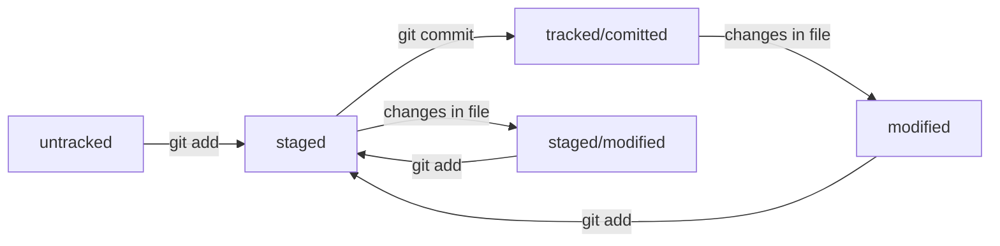

# Краткое руководство по Git
Данное пуководство было сделано как кейс при прохождении бесплатного курса "Основы Git"на площадке [Яндекс практикума](https://practicum.yandex.ru/).
## Что такое Git?
Git - система управления версиями, используемая разработчиками для контроля за изменениями в проекте. Она особенно хорошо себя показывает при командной разработке. При командной разработке она часто используется соместно с системами управления удалёнными репозиториями вроде GitHUB и GitLab.


## Установка Git
Для использования Git вам следует сперва его установить. Если вы пользователь Windows, то установите консольный инструмент [Git Bash](https://git-scm.com/download/win). Это терминал, который имеет схожий с Unix системами синтаксис команд. Так вам будет удобнее в дальнейшем использовать Git на любой системе. Терминал можно интегрировать в редактор VsCode. После установки откройте приложение Git Bash. 
В случае, если вы используете Linux, перейдите на [официальный сайт Git](https://git-scm.com/download/linux) и выберите команду установки для своей версии Linux. Скопируйте её в программу Terminal и нажмите Enter. Введите в терминал команду для проверки.
```
$ git version
```
На macOS установите менеджер пакетов [Homebrew](https://brew.sh/).На сайте есть команда для установки. Введите в терминал команду
```
$ brew install git
```
Проверьте установку командой
```
$ git version
```

## Работа с терминалом
Далее вам понадобятся некоторые первичные навыки работы с терминалом.
Вот шпаргалка по базовым командам.
### Структура поля ввода в терминал
Терминал ожидает принять от вас команду, когда выводит следующее сообщение:


**На Windows и Linux**
``` bash
userName@ComputerName <directiry> $
```
**На Macos**
``` bash
computerName:<directory> userName$
```
Здесь ```directory``` - директория, в которой вы назодитесь.  
Со значка ```$``` начинается ваше поле ввода команд. В дальнейшем, для  удобства восприятия, все команды в руководстве будут начинаться с ```$```, но вам его писать в терминал не надо.
### Названия директорий и файлов
У файла (папки(директории), которая, вообще, тоже считается файлом) есть два имени. Полное включает в себя путь к файлу, например ```/c/home-work/hw.txt```. По этому имени мы сразу понимаем, что файл ```hw.txt``` находится в папке ```home-work``` на диске ```c```. Зная полное имя файла (путь к файлу) можно обратиться к нему, находясь в любой директории. ```hw.txt``` будем называть сокращённым именем файла или просто именем файла. По нему можно обратиться к файлу из его родительской директории (здесь это папка ```home-work```). Далее рассмотрим часто используемы названия директорий.
* `.` - да, это просто точка (не забудьте отделить её пробелом от команды), она обозначает текущую дирректорию. Иногда при работе с терминалом приходится обращаться к текущей директории;
* ```..``` - две точки, они обозначают родительскую директорию, то есть стоящую на уровень выше той, в которой вы сейчас находитесь;
* ```~``` - это ваша домашняя директория, то есть папка, в котрой хранятся файлы пользователя. При запуске терминала, он находится именно в домашней дирректории. Если запустите терминал и введёте ```$ pwd``` 9о командах дальше, он покажет путь к вашей домашней дирректории. На Windows он будет выглядеть как то так: ```/c/Users/userName```;
* ```/``` для Linux или MacOS или ```/c/``` - корневая дирректория, то есть директория, находящаяся в начале пути к директории, в которой вы находитесь. UNIX-подобные системы и Windows отличаются. В них нет дисков, поэтому не надо вводить букву диска;
* ```.fileName``` - так обозначаются скрытые файлы и папки, для того, чтобы увидеть их призодится использовать специальные ключи при вводе команд. Вообще, директории ```.``` и ```..``` тоже считаются скрытыми директориями, лежащими в текущей.

Используя выше указанные специальные названия директорий можно легко перемещаться по файловой системе вашего компьютера. Например в Windows, находясь папке ```homework``` в в родительской директории ```~``` ( путь к ней ```/c/Users/userName/```), можно обратиться к файлу ```/c/users/userName/game/config.txt``` неаколькими способами:
* по пути, указанном в полном имени файла ```/c/users/userName/game/config.txt```;
* по пути из родительской директории `~/game/config.txt`;
* по пути из папки, в которой вы находитесь ```../game/config.txt```;
* перейти в директорию ```game``` командой ```$ cd ../game``` (о командах дальше) и обратиться напрямую по имени файла ```config.txt```.


*Если в названии директории или файла присутсвуют пробелы, то обращаться к нему надо через ковычки. Например, ```~/"home work"/"h w.txt"```.*
### Навигация  
* ```$ pwd``` - (print work directory) показывает, в какой директории вы находитесь;  
* ```$ ls <dir>``` - (list direcry contents) показывает, какие файлы и папки находятся в папке ```dir```, или в текущей папке, если поле ```dir``` пустое;   
* ```$ ls -a <dir>``` - работает аналогично предыдущей команде, но ключ ```-a``` позволяет посмореть скрыте паки и файлы;   
* ```$ cd <dir>``` - (change directory) переводит вас в папку ```dir```.  
#### Создание
* ```$ touch <file name>``` - создаёт файл с именем ```file name``` в текущей дирректории или в пути, указанном в имени файла;   
* ```$ mkdir <dir name>``` - (make directory) создаёт папку с именем ```dir name``` в текущей директории или в пути, указанном в названии дирректории.   
#### Копирование и преемещение
* ```$ cp <file> <dir>``` - (copy) копирует файл ```file```  в папку ```dir```;  
* ```$ mv <file> <dir>``` - (move) переносит файл ```file``` в папку ```dir```;  
### Чтение файла
* ```$ cat <file>``` - (con**cat**enate and print) показывает содержимое файла ```file```, но работает только с тектовыми файлами.
### Запись в файл
* `$ vim <file>` - откроет консольный редактор Vim для редактирования файла (о том, как он работате можете посмотреть, набрав команду `$ vimtutor ru`, это откроет гайд)
* `$ echo "text" > <file>` - вообще, команда `echo` просто выводит в консоль переданный ей аргумент, но используя символы перенаправления ввода `>`/`>>` можно ввести текст в файл. Представленная команда сотрёт содержимое `<file>` и введёт в туда ваш текст.
* `$ echo "text" >> <file>` - представленная команда допишет ваш файл введённой вами строкой.
### Удаление
* ```$ rm <file>``` - (remove) удаляет файл ```file``` безвозвратно (без перемещения в корзину); 
* ```$ rm -r <dir>``` - (**r** - recursive) удаляет все файлы и папки в директории ```dir``` безвозвратно;
* `$ rm -rf <dir>` - (**f** - force) ключ f позволяет удалить папку без лишних вопросов от терминала вроде "вы точно хотите удалить этот файл";
* ```$ rmdir <dir>``` - (remove directory) удаляет директорию ```dir``` безвозвратно, но работает только с пустыми папками;  
### Полезные возможности
* В полях `file`, `file name`, `dir`, `dir name` можно указывать как сокращенные названия файлов, для обращения к ним из текущих директорий, так и их полные имена (пути к ним из текущей, корневой или домашней директории).
* В терминал можно вводить сразу несколько команд, разделяя их с помощью `&&`. Например `$ mkdir try1 && touch fileA.txt && mv fileA.txt try1` создаст в текущей директории папку `try1`, создаст в текущей директории файл `fileA.txt` и переместит его в директорию `try1`.
* В некоторых случаях в полях `file`/`file name` или `dir`/`dir name` возможно указать сразу несколько имен файлов. Например `$ touch file1.txt file2.txt` создаст файлы `file1.txt` и `file2.txt` в текущей директории.
* У консоли есть собственная память — буфер с несколькими последними командами. По ним можно перемещаться с помощью клавиш со стрелками вверх (`↑`) и вниз (`↓`).
* Чтобы не вводить название файла или папки полностью, можно набрать первые символы имени и нажать `Tab`. Если файл или папка есть в текущей директории, командная строка допишет путь сама. Если файлов, начинающихся так несколько, то командная строка ничего не напишет. В таком случае нажмите `Tab` несколько раз для вывод всех возможных вариаций. Также можно дописывать команды. Если не пмините полное название команды, то введите первые её буквы, нажмите несколько раз Tab и терминал выдаст все команды, начинающиеся таким образом. Если команд/файлов слишком много, терминал потребует подтверждения вывода (введите y для подтверждения, n для отмены).

## Работа с Git
После того, как мы разобрались с базовыми коандами, используемыми при работе с терминалом, можем приступать к изучению работы с Git-репозиториями. Последовательно выполните действия, описанные в следующих параграфах.
### Настройка Git
Сперва надо настроить Git, а именно указать ваше имя или никнейм и электронную почту. Это необходимо для дальнейшей командной работы, чтобы было видно, кто какие изменения внёс в проект. Настройки Git хранятся в скрытом файле `.gitconfig` в домашней директории.
Для настройки введите команды 
``` bash
$ git config --global user.name "User Namovich" 
# имя или ник нужно написать латиницей и в кавычках

$ git config --global user.email username@yandex.ru
# здесь нужно указать свой настоящий email 
```
Флаг `--global` означает "глобальный".

Для проверки можете вызвать содержимое файла `.gitconfig`, чтобы убедиться, что настройки применены. Сделайте это командой:
``` bash
$ cat ~/.gitconfig
```
Либо командой:
``` bash
$ git config --list
```
Флаг `--list` означает "список" 
### Инициализация репозитория
Для того чтобы Git начал отслеживать измения в проекте необходимо сделать папку с файлами проекта Git-репозиторием. Для этого перейдите в директорию проекта и введите команду
``` bash
$ git init
```
Git создаст в этой директории скрытую подпапку .git. Это рабочая папка служебная папка Git, в которой он хранит информацию о об изменнеиях в вашем проекте.  
Если Git выдаст в терминал сообщение вроде `Using 'master' as the name...`, не пугайтесь, это просто пердупреждение о том, что ваша ветка по умолчанию называется 'master', и что вы можете изменить это значение по умолчанию указанными командами, например, на 'main'.  
### Удаление репозитория
Если в вдруг инициализировали не ту папку, можете "разгитить" её, удалив папку `.git`  
Для этого, находясь в репозитории, используйте команду 
``` bash
$ rm -rf .git
```
Но будьте осторожны с использованием этой команды. Такое удаление безвозвратно, и вы можете потерять всю информацию об изменениях в проекте.
### Проверка репозитория
Введите команду
``` bash
$ git status
```
Данная команда позволяет проверить состояние репозитория. У вас она выведет:
* название текущей ветки: `On branch master или On branch main`;
* сообщение о том, что в репозитории ещё нет коммитов: `No commits yet`;
* сообщение, которое говорит: «чтобы что-нибудь закоммитить (то есть зафиксировать), нужно сначала это создать» — `nothing to commit (create/copy files and use "git add" to track)`.
В дальнейшем используйте эту команду в любой непонятной ситуации.
### Добавление файлов в репозиторий
Теперь можете создавать в своём репозитории файлы. Хоть через GUI (графический интерфес пользователя, то есть через проводник или из САПРа), хоть через команду `touch`.  
После введите команду `$ git status`. Он сообщит вам, что в репозитории есть неотслеживаемые файлы (`untracked files`) и укажет вам их имена. Это значит, что Git еще не начал следить за изменеиями в соданных вамаи файлах. Значит, вам нужно добавить их в спиок отслеживания (его ещё называюе 'tracked files').  
Введите команды
``` bash
$ git add --all
$ git status
```
`git add --all` добавляет все файлы в вашем проекте в список отслеживания. Вместо `--all` можно указать имена конкретных файлов, которые вы хотите добавить или `.`, то есть указатель на текущую директорию. Это ещё называется индексацией файлов.  
`git status` выведет вам строку `Changes to be committed`, а под ней поля `new file: <имя одного из ваших файлов>`. Это значит, что ваши файлы попали в список 'staged', Git запомнил их состояние на момент команды `add` и готов сохранить, какие изменения в них произошли. Можно сказать, что Git добавил их на сцену и готов сделать снимок.  
Если вы измените содержимое в каком-то из файлов, и вызовите `ststus`, то он появится в новом поле `changes not staged for commit` после надписи `modified:`. Это значит, что Git заметил изменение в файле, но новая его версия не находится в списке 'staged', и для того чтобы сохранить изменения в нем, вам нужно снова добавить файл в этот список командой `git add <file>`.
### Выполнение коммита
Коммит - это сохранение изменений в вашем проекте в истории. Он даёт возможность откатиться, в случае чего, к предыдущим версиям проекта. Как сочетание клавишь `Ctrl+Z`, но для целой папки. 

Коммит вывполняется командой `git commit -m "<message>"`. В поле `message` указывается комментарий к комииту, ключ `m` позволяет указать этот комментарий.  

Сделайте коммит введя команду
```bash
$ git commit -m "мой первый коммит"
```
Терминал посторочно выдаст вам сообщение о том, в какой ветке был коммит, что это первый коммит (`root-commit`), сокращённы идентефикатор коммита, сколько файлов было изменено, сколько строк добавлено или убрано.   
Строки вида `create mode 100644 readme.txt` сообщают более подробную информацию о новых файлах. `create` - файл создан, `mode 100644` - тип файла (100644 - обычный файл, 100755 - исполняемый файл, 120000 - файл-ссылка в Linux).

Теперь при вызове `git status` терминал сообщит вам `nothing to commit, working tree clean`, что значит, что в проекте не было изменений со времен предыдущего коммита.

Таким образом, если ранее мы сравнили команду `git add` с добавлением объектов на сцену для дальнейшего фотоснимка, то `git commit` и есть делание этого самого фотоснимка. Он "снимает" состояние вашего проекта в списке "staged" (в терминале выводится как `changes to be commited:`) в данный момент.
#### Редактор Vim
Если забыть флаг `-m` и комментарий, то откроется редактор Vim. Лучше выйдете из него и сделайте коммит заново с флагом `-m`. Для этого введите `:q!` и нажмите `Enter`. Для того, чтобы научиться работе с редактором Vim введите в терминале команду `vimtutor ru`. Тогда откроется гайд по редактору на русском языке.
### Просмотр истории коммитов
#### Команда git log
Введите команду
``` bash
$ git log
```
Она выведет вам историю коммитов вместе с их хэш-идентификаторами (о них в следующем параграфе), автором коммита (строка `Author`), датой коммита (`Date`) и коментарием (нижняя строчка).  
Обратите внимание, что самый последний коммит находится вверху и обозначен:
``` bash
commit <hash> (HEAD -> master) #первый коммит имеет скобки после идентификатора
```
Можно вызвать сокращённую историю коммитов, состоящую лишь из сокращённых хэш идентификаторов и комментариев. Для этого нужно использовать флаг `--oneline`. Введите команду:
``` bash
$ git log --oneline
```
Обратите внимание, что если Git сам не вышел из просмотра логов, вам нужно нажать клавишу `Q` (**Q**uit - выход) на английской раскладке клавиатуры. Тогда вы вернетесь в режим набора команд.

В следующем параграфе чуть подробнее о Хэше.
#### Хэш - идентификатор коммита
Сделав несколько коммитов в своем проекте и вызвав `git log`, вы увидите историю своих коммитов с информацией о них. Каждая запись о коммитах будет начинаться со строчки, похожей на следующее:
``` bash
commit c87y453g087654gh23vfcgng2goifhasjhvb
```
Странный набор символов после слова `commit` является его хэш-идентификатором.

Хэширование - способ преобразовать набор данных и получить их "отпечаток". Git хэширует информацию о коммите с помощью алгоритма SHA-1 и получает для каждого из них набор из 40 символов. 

Особенность хэширования состоит в том, что:
* Если получить хэш дважды для одного и того же набора данных, результат будет одинаковым.
* Если исходные данные изменятся хоть на символ, то хэш изменится сильно.

Таким образом, хэширование позволяет получить уникальный идентификатор для каждого коммита, что позволяет ориентироваться в них. Многоие команды Git принимают в качестве параметра хэш коммита.

При использовании команды `git log --oneline` Git выведет вам историю коммитов с сокращёнными хэш-идентификаторами. Их можно использовать точно также, как полные. Git сам выбирает длину сокращённых Хэшей так, чтобы они были уникальными в пределах репозитория.

#### HEAD
При вызове `git log` вы заметите надпись `HEAD -> master` или `HEAD -> main` у самого верхнего коммита.

Файл `HEAD` - один из служебных файлов папки `.git` и указывает на последний коммит. Он содержит в себе следующую строчку:
``` bash
ref: refs/heads/master
```
Это ссылка на файл `refs/heads/master`, который уже содержит в себе хэш-идентификатор последнего коммита. Можете сами убелиться в этом командой `cat refs/heads/master` (если ваша основная ветка называется main, то везде замените master на main).

Таким образом, файл HEAD ссылается на последний коммит. Если вам нужно ввести команду, которая принимает в качестве параметра хэш коммита, то вмнесто хэша последнего коммита можно подставить слово `HEAD`. Git поймёт.
### Статусы файлов в Git
Ранее уже упоминались названия статусов файлов. Всего их 4.
* `untracked` - Git не отслеживает измения в файле, он еще ни разу не был добавлен в список отслеживания командой `git add`. Такие файлы находятся в списке `Changes not staged for commit:` и помечены как `untracked` при вызове `git status`.
* `tracked` - Git отслеживает изменения в файле, ведт к нему уже раз был применен `git add`. Находясь в tracked файлы также находятся в одном (или в обоих) из следующих статусов:
    * `staged` - Git запомнил изменения в файле после использования к нему команды `git add`. Такие файлы находятся в списке `changes to be commited` при вызове `git status`.
    * `modified` - Git определил, что файл изменился с момента последнего коммита или последнего ввода команды `git add`. Такие файлы находятся в списке `Changes not staged for commit:` и помечены `modified` при вызове `git status`.

Обратите внимание, файл может одновременно находиться в статусах `staged` и `modified`, если изменеия были внесены после команды `git add`. Тогда git закоммитит версию файла, которая была до измений. Еще раз примените `git add`, чтобы в `staged` попала новая версия файла.

Вот так выглядит схема переходов статусов файлов в Git:


### Оформление комментариев к коммитам
Комментарии к коммитам должны быть информативны и кратки. В них должно быть указано, что было изменено/добавлено, где и, иногда, почему. Часто используется инфинитивная форма глаголов. Есть несколько стилей оформления коммитов: **Корпоративный**, **Convertial Commits** и **GitHub-стиль**.
### Исправление коммита
Флаг `--ammend` позволяет внести изменения в последний коммит.

Если требуется исправить файлы в поледнем комите или дополнить его новыми файлами, то после `git add` введите команду
``` bash
$ git commit --amend --no-edit
```
Флаг `--no-edit` означает, что комментарий не надо изменять.

Если необходимо внести изменнения в комментарий, то введите команду:
``` bash
$ git commit --amend -m "Ваше сообщение"
```
### Откат изменений
#### Unstage изменений
Если необходимо убрать какой-то файл из спикска на коммит, то введите команду:
``` bash
$ git restore --staged <file>
```
Вместо file можно ввести `.` для того, чтобы убрать всю папку. 

Кстати, подсказка об этой команде выводится при вызове `git status` и наличии файлов в статусе `staged`.
#### Откат изменений, которые не попали в staging или коммит.
Если вы изменили файл и хотите откатить его до версии на момент предыдущего коммита или ввода команды `git add` (смотря, что было позже), введите команнду:
``` bash
$ git restore <file>
```
Где файл - имя файла, который надо откатить.
#### Откат коммита
Если необходимо вернуть проект к предыдущей его версии, введите команду:
```bash
$ git reset --hard <commit hash>
```
Где `<comit hash>` - хэш коммита, к которому необходимо откатиться (посмотрите его в логе). Но будьте осторожны. Все более поздние коммиты будут удалены.
### Просмотр изменений
Для просмотра измений используется команда `git diff` (**diff**erent - отличие) с различными флагами.
#### Сравнение с последним коммитом
Ввод команды
``` bash
$ git diff
```
Сравнит файлы, находящиеся в списке modified с последним коммитом.  
Если добавить флаг `--staged`, то с последним коммитом сравнятся файлы в staged.
#### Анализ вывода команды
Допустим, мы создали файл `teremok.txt` в гит-репозитории и добавили туда следующии строчки:
```
Теремок стоит, и в нём:
никого нет
```
Потом мы закоммитилли этот файл. Потои мы изменили последнюю строчку c `никого нет` на `Мышка-норушка`, файл попал в modified. Тогда команда `git diff` выведет примерно следующее:
``` bash
diff --git a/teremok.txt b/teremok.txt
index 901da07..ac459 100644
--- a/teremok.txt
+++ b/teremok.txt
@@ -1,2 +1,2 @@
Теремок стоит, и в нём:
-никого нет
+Мышка-норушка
```
Здесь:
* Первые две строки (`diff --git a/... b/...` и `index 901da07..ac459e1 100644`) — это какая-то низкоуровневая техническая информация.
* Строки `--- a/teremok.txt` и `+++ b/teremok.txt` говорят, что дальше будет выведен результат сравнения файлов `a/teremok.txt` и `b/teremok.txt` — исходной и измененной версий (`---` - помечает прошлую, `+++` -текущую версии).
* Строка `@@ -1,2 +1,2 @@` сообщает, какие строки файла попали в сравнение. Выражение `1,2` говорит, что были использованы две строки, начиная с первой. `-` помечает оригинальную версию, `+` - измененную.
#### Сравнение двух коммитов
Чтобы сравнить два коммита, введите команду:
``` bash
$ git diff <hash1> <hash2>
```
На места полей `<hash>` подставьте хэши илии сокращенные хэши коммитов, которые вы сравниваете. Имейте в виду, что команда будетсравнивать состояние файлов на момент первого переданного коммита с состояние на момент второго. То есть для получения хронологически правильного вывода есть смысл вставить более новый коммит в поле `<hash2>`, а более старый в `<hash1>`. Иначе изменения будут выводится в обратном хронологическом порядке и с противоположными знаками.
### Игнорирование файлов
Для того, чтобы git автоматически игнорировал какие-то файлы (как правило, это файлы настройки среды разработки, exe-шинки, временные файлы, создавемые при компиляции), необходимо создать в репозитории файл `.gitignore`, в котором просто построчно перечисляются файлы, которые необходимо игнорировать. В `.gitignore` применяются следующие синтаксические конструкции:
* `#` - делает всю оставшуюся строчку комментарием.
* `<file_name>` - просто название файла, добавляет в игнор файл с таким названием во всех подпапках проекта.
* `*` - соответсвует любой строчке, в т.ч. пустой, а также может заменить название одной папки в пути (пример `docs/*/tmp` - добавляетв игнор все файлы tmp в подпапках папки docs).
* `?` - соответсвует ровно одому символ.
* `[...]` - соответсвует ровно одному символу из перечисленных в скобках, можно использовать перечиление (`[abc]`) или диапазон (`[a-c]`).
* `/` - определяет директорию, в которой надо искать неотслеживаемые файлы (например `/ref/todo.txt` - игнор только файлa todo.txt, находящегося в директории`ref/`, а `/ref/`- игнор всей директории) Обратите внимание, если в конце названия стоит `/` - это папка, если не стоит - это файл.
* `**` - как `*`, но способны заменить любое количествор папок в пути, а не только дону, как `*`. В том числе, способны заменить и 0 папок (например `docs/**/tmp` добавит в игнор вообще все файлы `tmp`, находящиеся в `docs/`).
* `!` - инверсия правила, то есть определяет, что **не стоит** игнорировать.

`git status` не выводит файлы из `.gitignore` в терминал для экономии места. Чтобы это обойти используйте ключ `--ignored`, тогда в статусе появится раздел `Ignored files`.
## Работа с GitHub
Для командной работы над фалами необходимо завести удалённую версию репозитория.  
GitHub - платформа для хранения IT-проектов и совместной работы над ними с использованием Git. Принадлежит Microsoft, имеет аналоги. Один из них - GitLab. Это opensource проект, который еще и позволяет создавать удалённые Git-репозиории на серверах компаний.  
Далее мы разберем, как начать работать с GitHub. Следуйте инструкциям в параграфах.
### Регистрация на GitHub
Зарегистрируйтесь на [GitHub](https://github.com/). Думаю, с этим вы справитесь без моих подсказок. Процесс регистрации аналогичен регистрации в любой другой социальной сети.
### Создание удалённого репозитория на GitHub
1. Зайдите в свой профиль по ссылке `https://github.com/username`, где `username` — имя, которое вы указали при регистрации.
2. Перейдите во вкладку **Repositories**, а затем нажмите **New**.
3. Назовите свой репозиторий (желательно также как на компьютере, чтобы не путаться), выберите, хотите вы сделать его публичным или частным, нажмите на кнопку **Create repository**.

Теперь свяжем удалённый репозиторий с локальным.
### Генерация SSH-ключей
Чтобы получить доступ к репозиторию на GitHub, вам необходимо подтвердить вашу личность и права на это. Для этого придумали использовать протокол SSH (Secure Shell Protocol).

SSH использует пару ключей:
* Приватный ключ - хранится только на вашем компьютере, его ни в коем случае нельзя никому передавать. Нужен для расшифровки отправленных вам данных.
* Публичный ключ - этот ключ используется для шифрования данных. Вы передаёте его любому, от кого хотите получить транзакцию и он шифрует ее, используя этот ключ.

#### Проверка SSH-ключей
Спрева убедитесь, что у вас ещё нет SSH-ключей. Обыно они хранятся в директории `~/.ssh`.
Находясь в домашней директории, введите команлду
``` bash
$ ls -la .ssh/ # вывели список созданных ключей
```
Если папка пустая или её нет, то всё нормально.
Если появятся файлы вроде
* `id_dsa.pub`;
* `id_ecdsa.pub`;
* `id_ed25519.pub`;
* `id_rsa.pub`.  

То у вас уже есть ключи. Если вы их не делали, то удалите.
#### Генерация SSH-ключей
1. Для генерации используйте команду:
    ``` bash
    $ ssh-keygen -t ed25519 -C "электронная почта, к которой привязан ваш аккаунт на GitHub"
    ```
    Если появилось сообщение об ошибке, то ваш компьютер не поддердивает алгоритм шифрования `ed25519`. Используйте другой алгоритм, введите команду:
    ``` bash
    $ ssh-keygen -t rsa -b 4096 -C "электронная почта, к которой привязан ваш аккаунт на GitHub"
    ```
    После ввода отобразится сообщение:
    ``` bash
    > Generating public/private rsa key pair. # сгенерированы публичный и приватный ключи
    ```
2. Укажите место хранения ключей. Можете ничего не указывать, тогда путём по умолчанию станет ваш каталог пользователя.
    ``` bash
    > Enter a file in which to save the key (C:\Users\<имя_пользователя>\.ssh\):[Press enter]
    ```
3. Прграмма запросит кодовую фразу для доступа к SSH-ключу. Её придётся вводить каждый раз при взаимодействии с удлённым репозиторием. Можете оставить это поле пустым, тогда ничего не придётся вводить.
    ``` bash
    > Enter passphrase (empty for no passphrase): [Type a passphrase]
    > Enter same passphrase again: [Type passphrase again]
    ```
4. Проверьте, что ключи действительно сгенерированы. Введите
    ``` bash
    ls -a ~/.ssh
    ```
    Должны быть выведены имена двух файлов. Тот, что с раширением pub - публичый ключ, второй - приватный ключ, ни в коем случае никуда его не передавайте.
#### Связывание SSH ключа с GitHub-аккаунтом
1. Скопируйте содержимое файла `id_ed25519.pub`/`id_rsa.pub`. Это можно сделать если вывести на жкран содержимое файла комагдой `cat <file>`
2. Перейдите на аккаунт GitHub, выберите **Settings** в иеню аккаунта.
3. В меню слева откройте **SSH and GPG keys**.
4. В открывшемся окне выберите **New SSH key**.
5. В поле **Title** укажите название ключа, в поле **Key type** должно быть **Authentication Key**, в поле **Key** вставьте содердимое файла с расширением `.pub`.
6. Нажмите **Add SSH Key**.
7. Проверьте правильность ключа командой
    ``` bash
    $ ssh -T git@github.com
    ```
    Если вы в первый делитесь проектом на GitHub, в термнале появится предупреждение следующего вида:
    ``` bash
    The authenticity of host 'github.com (140.82.121.4)' can't be established. ED25519 key fingerprint is SHA256:+DiY3wvvV6TuJJhbpZisF/zLDA0zPMSvHdkr4UvCOqU. This key is not known by any other names. Are you sure you want to continue connecting (yes/no/[fingerprint])?
    ```
    Оно сообщает, что вы никогда не соединялись с сервером GitHub, поэтому проверьте, что этот сервер подлинный. Для подтверждения подлинности сервер генерирует и публикует ключи SHA256.  Перейдите по [ссылке](https://docs.github.com/en/authentication/keeping-your-account-and-data-secure/githubs-ssh-key-fingerprints). Если ключ в пердупреждении совпадает с ключём на сайте, то всё ок, вводите ```yes```.
### Связывание локального и удалёного репозитория
Для связывания используется команда 
``` bash
$ git remote add <имя удалённого репозитория> <URL-ссылка на удалённый репозиторий>
```
Под именем здесь пордразумевается псевдоним, которым вы назовёте удалённый репозиторий на вашем компьютере. Обычно выбирается псевдоним `origin`. Выполните следующую последовательность действий.

1. На GitHub скопируйте URL ссылку на ваш удалённый репозиторий типа SSH.
2. Перейдите в директорию локального репозитория.
3. Введите описанную выше команды, это будет выглядеть следующим образом:
    ``` bash
    $ git remote add origin git@github.com:%ИМЯ_АККАУНТА%/first-project.git 
    ```
4. Убедитесь, что репозитории связаны. Для этого введите команду
    ``` bash
    $ git remote -v
    ```
    Флаг `-v` здесь короткая форма флага `--verbose`, что значит подробный (делает вывод подробнее).  
    При выводе вы должны увидеть похожие строчки:
    ``` bash
    origin    git@github.com:%ИМЯ_АККАУНТА%/%ИМЯ-ПРОЕКТА%.git (fetch)
    origin    git@github.com:%ИМЯ_АККАУНТА%/%ИМЯ-ПРОЕКТА%.git (push)    
    ```
### Синхронизация удалённого и локального репозиториев.
Для отправки данных на удалённы репозиторий используется команда `git push`.  

Введите команду
``` bash
$ git push -u origin master
```
Флаг `-u` сможет связать текущую ветку локального репозитория (в команде она указан ка master) с аналогичной в указанном удалённом репозитории `origin` (если там нет веток, то она создаст ветку).

В дальнейшем для отправки новых коммитов в ветку удалённого репозитория будет достаточно использовать лишь команду:
``` bash
$ git push
```
### Файл README.md
Для описания проекта на github используется специалный формат файлов **markdown** (расширение файла `.md`). Часто файл с описанием называется `README.md`. Формат **markdown** представляет широкий спектр возмодностей для редактирования и форматирования текста. О синтаксисе markdown вы можете помотреть в [шпаргалке на GitHub](https://gist.github.com/fomvasss/8dd8cd7f88c67a4e3727f9d39224a84c).
### Клонирование репозитория
Клонирование репозитория - это копирование удалённого репозитория на ваш компьютер и дальнейшая синхронизация вашего локального репозитория с удалённым.

Выполняется командой
``` bash
git clone <SSH-link>
```
Из папки, в которой вы хотите создать локальный репозиторий. Обратите внимание, Git сам создаст дитректорию локального репозитория и подпапку .git в ней, а также скопирует в директорию все файлы с удалённого репозитория. `<SSH-link>` - SSH-сылка на удалённый репозитоий, работает только при синхронизации вашего GitHub (или GitLab, или какого то еще) аккаунта с компьтером по протоколу SSH. Можно также использовать HTML-ссылку, но придётся вводить пароль.
### Fork репозитория
Fork (ответвление (англ.)) является GitHub-операцией. Часто вы не можете аносить изменения в чужие удалённые репозитории с помощью `push`. Однако поучаствовать в чьём-то opensource-проекте хочется. В таком случае вы можете выполнить Fork чужого публичного репозитория, это скопирут его на ваш GitHub аккаунт, и вы сможете работать с ним после выполнения команды `git clone`. Когда вы поработаете над форкнутым проектом, можете запросить у авторов оригинального репозитория внести ваши изменения в свой код с помощью **pull request**'а.

Для выполнения fork'а перейдите на страницу интересующего вас репозитория и нажмите кнопку `Fork` справа от названия репозитория. GitHub откроет страницу, на которой вы сможете назвать форкнутый репозиторий и выбрать, хотите ли вы форкнуть только главную ветку или все.
## Ветки в Git
Ветки являются способом разделить разработку проекта на несколько потоков. В каждой ветки хранится свой список коммитов, которые не мешают друг другу. Создание веток удобно при экспериментировании проектом и при командной разработке (каждый программист работает в своей ветке).
### Просмотр веток проекта
Команда
``` bash
$ git branch
```
Выведет список веток репозитория. Звёздочкой `*` будет отмечено, в какой ветке находитесь вы.

Обычно в основной ветке проекта хранится его основная версия, а от неё уже отходят другие ветки.
### Создание ветки проекта
Создание новой ветки происходит командой
``` bash
$ git branch <branch name>
```
Где вместо `<branch_name>` указывается имя новой ветки.

В названии ветки могут использоваться любые буквы, цифры, а также 4 символа `.`, `-`, `_`, `/`. В названии веток не должно быть пробелов. Хорошим подходом считается, когда в названии указывается сперва тип работ, проводимых в ветке (`bugfix` - исправление ошибки, `feature` - проработка функциональности), а потом через `/` описание проблемы или задачи. Например `feature/add-branch-info`.
### Переключение на ветку проекта
Переключение выполняется командой: 
``` bash
$ git checkout <branch name> #branch name - имя ветки, на которую переключаетесь
```

А следующая модификация команды позволяет вам создать ветку и сразу переключиться на неё:
``` bash
$ git checkout -b <branch name> #branch name - имя ветки, которую создаёте
```
Кстати, ветки в Git являются указателями на последний коммит, и способны указывать на один и тот же коммит.

### Сравнение веток
Сравнение выполняется командой:
``` bash
$ git diff <branch 1> <branch 2> # branch 1, branch 2 - названия сравниваемых веток
```
Также вместо полей `branch` можно указать хэщ коммитов, ведь, как уже было сказано ранее, ветки всего лишь ссылаются на последние коммиты.
#### Суффикс навигации
Вмсето хэшей коммитов можно вводить следующую структуру:
``` bash
commit~n
```
Здесь commit - известный указатель коммита (например, HEAD, название ветки или изветсный хэш), а после `~` стоит число, на которое отсчитываются коммиты назад. Например, HEAD - нулевой коммит, HEAD~1 - предыдущий (первый назад) коммит, HEAD~5 назад коммит. Или, например, main~1 - предыдущий коммит в ветке main.